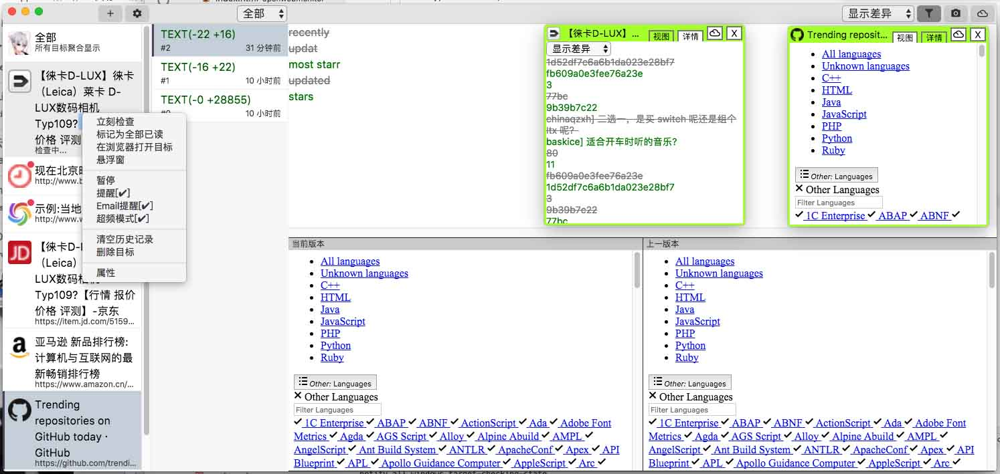
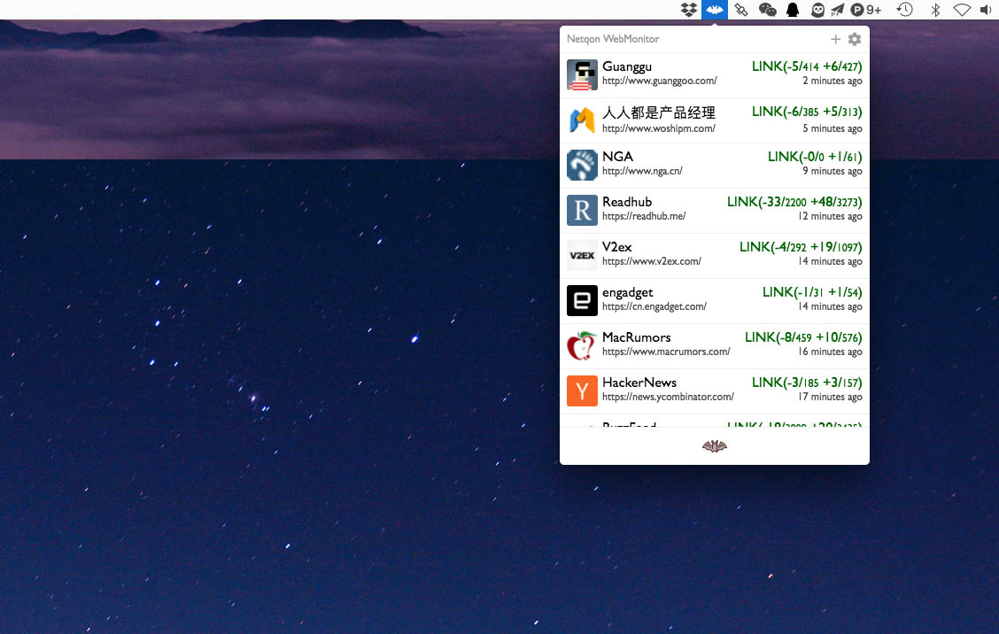
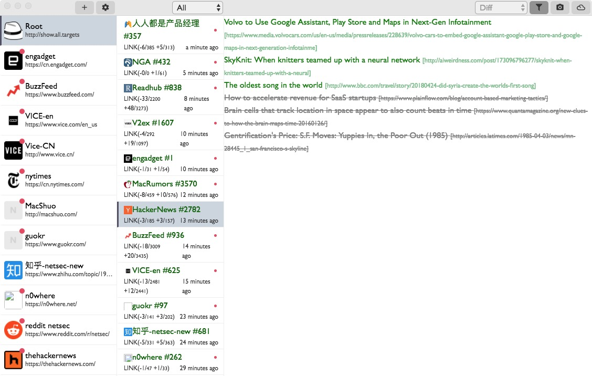

# OpenWebMonitor

网页内容监视器，网页内容变更监控，网页监控，网站内容变化检测，监控网页内容变化。支持动态内容，支持选择特定区域。

### 下载

[前往官网 (macOS/Windows)](http://openwebmonitor.netqon.com/)

### 截图

### 帮助信息

[文档](http://fatecore.com/p/OpenWebMonitor/)

用户QQ2群：945140787

### LISCENSE
MIT
提示：此处代码仅含v1-2版本。

©️2018-2019 fatecore.com